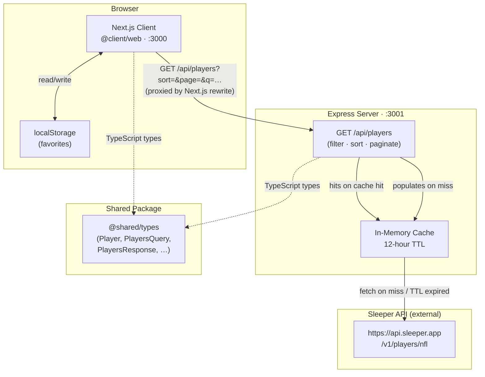

# Architecture

## High-Level Overview

## Request Flow

1. **User interaction** — the user types a search term, selects filters, or changes the sort column in the Next.js UI.
2. **Debounce & abort** — the client debounces the search input (300 ms) and cancels any in-flight request before issuing a new one.
3. **Next.js rewrite** — `next.config.js` rewrites `/api/*` to `http://localhost:3001/api/*`, so the browser never talks to the Express server directly (avoids CORS in development).
4. **Server filtering** — Express receives the query params, validates them in `normalizeQuery()`, then filters/sorts/paginates the in-memory player list via `applyQuery()`. Only the requested page of results is returned.
5. **Cache** — on first request (or after the 12-hour TTL) the server fetches the full Sleeper players endpoint (~5–10 MB), normalises it, pre-computes a "usable" subset (active players with fantasy positions), and stores both in memory. Subsequent requests are served entirely from RAM.
6. **Facets** — the response includes `facets` (distinct positions, teams, statuses) derived from the active dataset so the client can populate filter dropdowns without a separate request.
7. **Favorites** — stored client-side in `localStorage` only. The client passes the list of favorited IDs as a query param when `favoritesOnly` is enabled; no server-side persistence is required.

## Package Structure

| Package | Role |
|---|---|
| `packages/client` | Next.js 13 app — UI, data fetching, favorites state |
| `packages/server` | Express API — Sleeper proxy, cache, query engine |
| `packages/shared` | TypeScript types shared between client and server |
